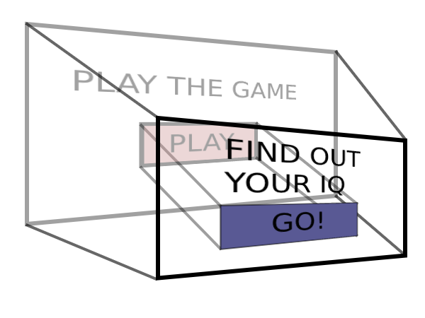
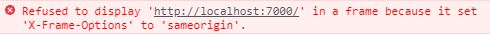

# Clickjacking

This attack requires the user to navigate to a specific page prepared by the hacker. The hacker prepares a web page that will be interesting for the potential user. This kind of pages are mostly clickbaits. They can declare that thanks to this page you will know the answer to the most intriguing mystery of all times or that you are the lucky winner of the newest iPhone. There are a lot of people that will try to satisfy their curiosity and will visit the attacker's page.

After the visit the page may seem to look like what we expect. The web page seems to contain the information that you expect. But most likely to get the desired information, the user will be asked to take additional action, like click the button.

What the user doesn't know is that the effective page is hidden behind the visible page components. The button that is visible does nothing, but behind it there is another button that handles the harmful action. When the user clicks the dummy button, the click is passed to the hidden button and triggers the unsafe action.



This attack may seem to be quite surreal, but it appears to be quite common on social media where a lot of articles are being shared. When a user sees a link shared by their friend, he is more likely to fall for such attack as he does not expect to be hacked.

## How does it work

The harmful application is hosted in an *iframe* element. Its address is set in the *src* attribute. This way the content of the harmful page is embedded on the attacker's page.

```html
<iframe src="http://link-to-some-harmful-page.com"></iframe>
```

The interactive HTML element needs to be resized to fit exactly the interactive HTML element on the clickbait page. Its position needs to be the same. Using CSS styles the *iframe*'s opacity is changed to 0, hiding the harmful element. This way the attacker makes sure that any action taken on the interactive HTML element of the clickbait page will be effective on the hidden interactive HTML element on the embedded harmful page.

## Example

1. Open a command line in the *vulnerable-app* folder and run ```npm run start```
2. Open a command line in the *attacker-app* folder and run ```npm run start```
3. Open a web browser and navigate to http://localhost:7000/
4. Click **Login** button and observe that you have been logged in as the *New User*
5. Refresh the **Vulnerable app**. You can see that you are still logged in as the *New User*
6. Open a web browser and navigate to http://localhost:7001/
7. Click **Load more kittens** button
8. Refresh the **Vulnerable app**

You can observe that after refresh you have been logged out of the application, even though you have not pressed the **Logout** button. The **Attacker app** has performed the logout action. The **Logout** button has been hidden behind the **Load more kittens** button. You can manipulate the *iframe* opacity to peek the hosted **Vulnerable app** in the **Attacker app**.

## How to defend

One of the examples of how to make our application resistant to such attacks is to add the **X-Frame-Options** header to the response when fetching the vulnerable application. The value of this header should be set to **SAMEORIGIN**. This prevents from hosting the vulnerable application on other domains. In other words in order to host the application, these three values need to be the same for both applications:

* protocol (http, https, etc.)
* domain
* port

There are libraries that take care of this for us. One of them is [**helmet**](https://github.com/helmetjs/helmet). In order to enable this feature in helmet the following code needs to be added before starting the server of our application:

```javascript
const helmet = require('helmet');
app.use(helmet());
```

And that's it! From now on when someone tries to host your application from some other domain, he will get a following console error:



[Go to top](#clickjacking)  
[Back](../README.md)
