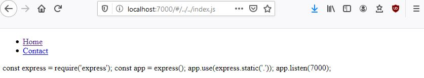

# Path traversal

It is also known as **Directory traversal** or **dot dot slash slash attack**. Thanks to this attack, the user is able to list and peek files on the server. This gives an unattended access to file contents as well as the architecture of the application, which may lead to further attacks. The hacker may as well access the configuration files or the server commands history which may reveal details regarding the server configuration. In some situations it is also possible to write or change content of the server files.

## Example

1. Open a command line in the *path-traversal* folder and run ```npm run start```
2. Open a web browser and navigate to http://localhost:7000/
3. Click **Home** link and observe that the URL changes to http://localhost:7000/#/home.html
4. Navigate to http://localhost:7000/#/../../index.js
5. Observe that the web page displays the content of the **index.js** file



## How to defend

One of the simplest ways to defend from path traversal is whitelisting the routes available in the application. First, create the collection of routes that should be available for the user. In this example there are two such routes: *home* and *contact*.

```javascript
const files = [
    'home.html',
    'contact.html'
];
```

Next step is to check before each navigation whether the desired route is on the whitelist.

```javascript
async function navigate(page) {
    if(!files.includes(page)) {
        console.warn('Access denied');
        return;
    }

    ...
}
```

[Go to top](#path-traversal)  
[Back](../README.md)
